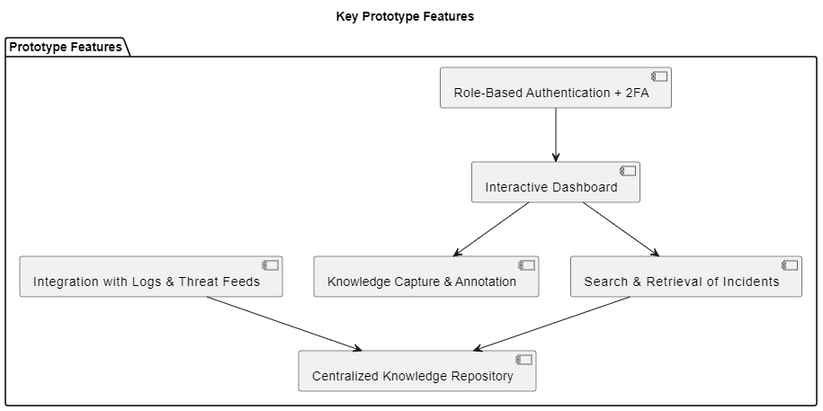
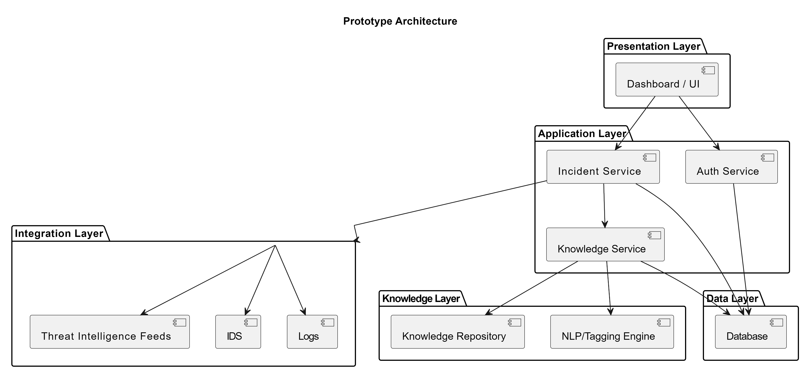
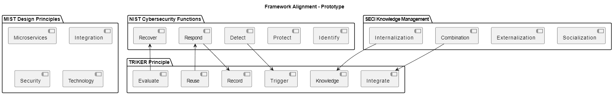
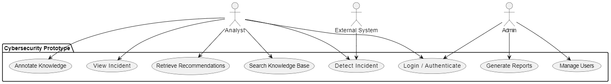
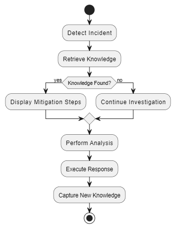
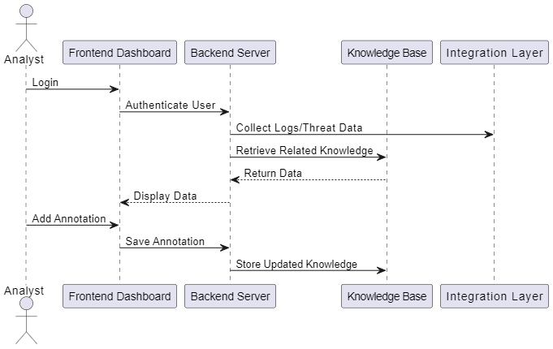
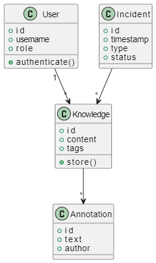
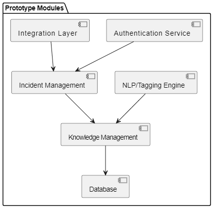

# Prototype Framework to Improve Cybersecurity Incident Response Using Institutional Knowledge

## A Case Study of Kenya Agricultural and Livestock Research Organization (KALRO)

---

## Description

This project presents a **prototype framework** to enhance cybersecurity incident response by capturing, structuring, and integrating **institutional (tribal) knowledge**.  

Many organizations rely on undocumented expert experience. This prototype demonstrates how tacit knowledge can be transformed into **searchable, reusable intelligence** to support faster and more effective incident response.  

The design follows **NIST Cybersecurity Framework principles** and **MIST design concepts** to ensure modularity, security, and potential integration with existing tools.

---

## Objectives

- Explore methods to capture undocumented institutional knowledge  
- Prototype integration into cybersecurity workflows  
- Demonstrate improvements in response speed and decision-making  
- Reduce dependency on individual expertise (proof-of-concept)  
- Create a **searchable prototype repository** for knowledge  

---

## Key Prototype Features

- **Role-based authentication with optional 2FA**  
- **Interactive dashboard mockup for incident monitoring**  
- **Knowledge capture and annotation demonstration**  
- **Prototype search and retrieval of past incidents**  
- **Conceptual integration with logs and threat intelligence feeds**  
- **Simulated centralized knowledge repository**  



## Prototype Architecture

- **Presentation Layer** – Mockup interface/dashboard  
- **Application Layer** – Prototype business logic  
- **Knowledge Layer** – Tagging and indexing simulation  
- **Integration Layer** – Conceptual connection with logs/external systems  
- **Data Layer** – Simulated storage for incidents and knowledge  



## Framework Alignment

This prototype aligns with established frameworks and design principles to ensure **security, scalability, and effective knowledge management**.

- **NIST Cybersecurity Functions:** Provides structured incident management.
  - Identify: Know assets and risks  
  - Protect: Secure access and data  
  - Detect: Monitor logs and alerts  
  - Respond: Execute mitigation strategies  
  - Recover: Capture lessons learned and restore operations

- **SECI Knowledge Management:** Captures and shares institutional knowledge.
  - Socialization: Team discussions and collaboration  
  - Externalization: Annotate and record incident insights  
  - Combination: Integrate knowledge across incidents  
  - Internalization: Apply lessons learned to future responses

- **MIST Design Principles:** Ensures modularity and modern system design.
  - Microservices: Separate prototype components (Auth, Incident, Knowledge, NLP)  
  - Integration: Connect with external systems (Logs, IDS, Threat Feeds)  
  - Security: Role-based access control, encryption, 2FA  
  - Technology: Supports future automation and NLP tagging

- **TRIKER Principle:** Guides effective knowledge lifecycle.
  - Trigger: Initiate workflows when incidents occur or actions performed  
  - Record: Document insights, annotations, and lessons learned  
  - Integrate: Merge new knowledge with existing repository  
  - Knowledge: Structure information for easy retrieval and analysis  
  - Evaluate: Assess quality, relevance, and accuracy of captured knowledge  
  - Reuse: Apply past knowledge to improve future responses


---
## Prototype Workflow (Pseudo-Algorithm)

```text
BEGIN

// MIST: Microservices Initialization
1. Initialize Prototype Services:
   - Auth Service
   - Incident Service
   - Knowledge Service
   - Integration Service
   - NLP/Tagging Service (simulated)

// NIST: IDENTIFY
2. Load Prototype Context:
   - assets
   - users
   - example tribal knowledge

3. Authenticate User
   INPUT: credentials + optional 2FA
   IF valid THEN
       grant RBAC access
   ELSE
       deny access
   ENDIF

// MIST: Integration
4. Collect Prototype Incident Data from simulated logs, IDS, threat feeds

// NIST: DETECT
5. Detect Incident (simulated)
   IDENTIFY anomalies and patterns

6. Extract Entities: IP, user account, file hash

// NIST: RESPOND
7. Retrieve Tribal Knowledge
   IF match found THEN
       DISPLAY mitigation steps
   ELSE
       continue investigation
   ENDIF

8. Perform Analysis (annotations, collaboration)

9. Execute Response (simulated mitigation)

// NIST: RECOVER
10. Capture New Knowledge (observations, lessons)

// MIST: Technology
11. Process Knowledge (NLP tagging, categorization, indexing)
12. Store in Prototype Database

// MIST Security + NIST Protect
13. Enforce Security (encryption, RBAC, audit logs)

// Continuous Improvement
14. Feedback Loop (update knowledge relevance and response efficiency)

END

## UML Diagrams

### 1. Use Case Diagram
**Purpose:** Show who interacts with the system and what they do.  
**Actors:** Cybersecurity Analyst, System Administrator, External Systems (e.g., IDS, Logs)  
**Use Cases:** 
- Login / Authenticate  
- Detect Incident  
- View Incident  
- Annotate Knowledge  
- Search Knowledge Base  
- Retrieve Recommendations  
- Manage Users  
- Generate Reports  

**Tip:** Use stick figures for actors, ovals for use cases, and a system boundary box.



---

### 2. Activity Diagram
**Purpose:** Illustrate step-by-step workflows of the system.  
**Example Flow:** Start → Detect Incident → Retrieve Knowledge → Decision (Knowledge Found?) → Analyze → Respond → Store Knowledge → End  
**Tip:** Include decision diamonds, arrows for flow, and parallel actions if needed.



---

### 3. Sequence Diagram
**Purpose:** Show interactions over time between system components.  
**Key Components:** User (Analyst), Frontend Dashboard, Backend Server, Knowledge Base, Integration Layer  
**Example Flow:** 
1. User logs in  
2. System authenticates  
3. Incident detected  
4. System queries Knowledge Base  
5. Results returned  
6. User annotates  
7. System saves data  

**Tip:** Represent vertical lifelines for components and horizontal arrows for messages.



---

### 4. Class Diagram
**Purpose:** Display system structure, entities, and relationships.  
**Key Classes:** User, Incident, Knowledge, Annotation, Entity (IP, File, User), Report  
**Include:** 
- Attributes (id, name, timestamp)  
- Methods (save(), retrieve())  
- Relationships (e.g., User → Knowledge one-to-many, Incident ↔ Knowledge association)  



---

### 5. Component Diagram
**Purpose:** Show system architecture and modules.  
**Key Components:** Authentication Service, Incident Management, Knowledge Management, NLP/Tagging Engine, Integration Layer, Database  

